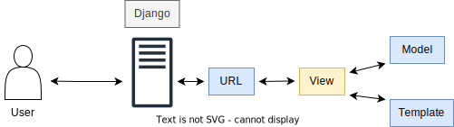

# Software Architecture 🧱 
L'architettura del nostro software è basata sul pattern **MVC** (Model View Controller). Perciò abbiamo il front-end che ha il ruolo di view in quanto mostra i risultati voluti dall'utente; il back-end invece ricopre sia del ruolo di model, infatti fornisce i metodi per accedere ai dati utili dell'applicazione, che quello di controller, in quanto riceve i comandi dell'utente (attraverso la view) e li attua modificando lo stato degli altri 2 componenti.

Di seguito dettagliamo in modo più specifico le caratteristiche dell'architettura che segue il framework che utilizziamo per lo sviluppo back-end `Django`.

**Model**

Il Model è responsabile della gestione di tutte le attività relative ai dati. Può essere una tabella in un database, un file JSON o qualsiasi altra cosa.
Inoltre il Model prende i dati da dove archiviati e quindi li elabora prima di inviarli alla View.
Il Model è un componente dell'architettura di Django che contiene la Business Logic.
Il flusso di informazioni è il seguente: quando ti iscrivi a qualsiasi sito web, si effettua un clic su un pulsante di registrazione. Quando si fa clic sul pulsante di registrazione, viene inviata una richiesta al Controller. Quindi il Controller chiama il Model e gli chiede di applicare la logica sul modulo che viene ricevuto come parametro. Il Model quindi applica la sua logica e fornisce una risposta al Controller. Il Controller passa quindi la risposta a te, che sei il client.

**View**

Il componente View nell'architettura Django viene utilizzato per visualizzare i dati dal componente Model. Può anche essere utilizzato per raccogliere dati dall'utente e inviarli al Model come input del modulo.
In questo modo, il componente View contiene la logica dell'interfaccia utente.
Ad esempio, se si fa clic su una spesa e poi vai alla pagina dei dettagli, la nuova pagina web che viene generata è la visualizzazione dei dettagli della spesa. Allo stesso modo, se si fa clic su una categoria e poi si passa alla visualizzazione per categoria, la nuova pagina Web generata è la visualizzazione per categoria.

**Controller**

Poichè il controller decide quale vista visualizzare, ha il potere di manipolare il modello della vista.
In questo modo, può applicare qualsiasi logica e regola al modello della vista. Il controller determina anche come visualizzare la vista e come rispondere all'input dell'utente.
Possiamo dire che il controller è colui che decide quando e cosa deve essere visualizzato. I controller sono molto utili per mantenere il nostro codice DRY (Don't Repeat Yourself), gestibile e scalabile.

**Benefici dell'architettura di Django**

Il framework Django utilizza questa architettura e non richiede codice complesso per farcomunicare tutti e tre questi componenti. Ecco perché Django sta diventando popolare.

I seguenti sono alcuni dei vantaggi dell'utilizzo di questa architettura in Django:

• **Sviluppo rapido**: più sviluppatori possono lavorare contemporaneamente su diversi aspetti della stessa applicazione. 

• **Debolmente accoppiato**: ogni parte dell'architettura di Django deve essere presente per mantenere un alto livello di sicurezza del sito web.

• **Facilità di modifica**: il vantaggio di utilizzare Django è che ci offre molta più flessibilità nella progettazione del nostro sito Web rispetto ad altri framework.

