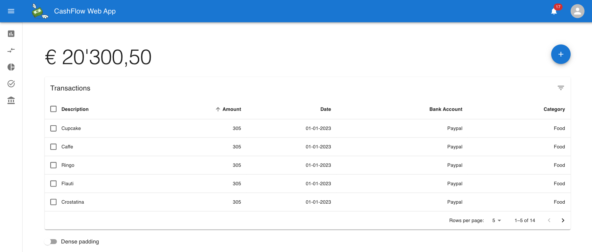
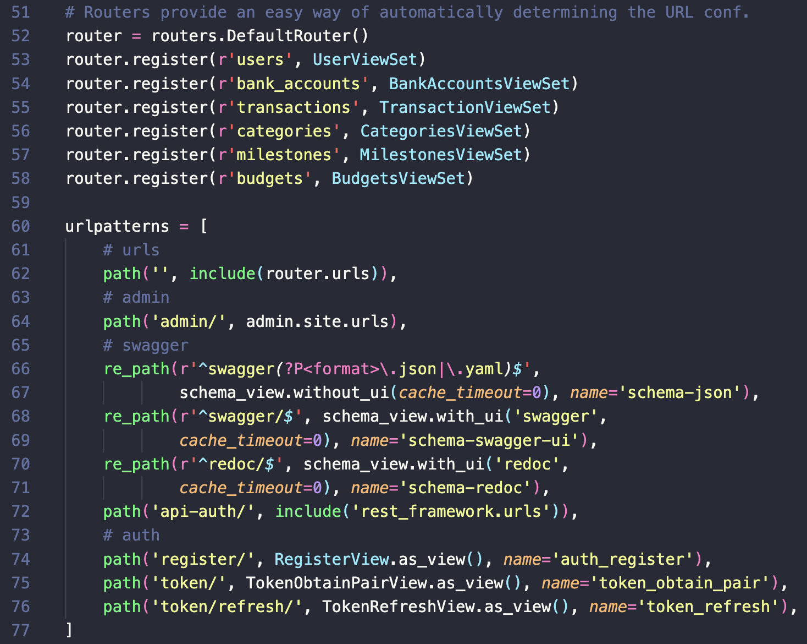

# Software Maintenance 👷🏻‍♂️
All'interno del progetto abbiamo eseguito due tipi di manutenzione:
- _Perfettiva_ e _Refactoring_ per migliorare l'interfaccia utente e risolvere quindi alcuni Bad Smells
- _Preventiva_ per aggiornare la documentazione e i commenti

Non è stata documentata la _manutenzione correttiva_ perché il progetto era ancora in fase di sviluppo e quindi non aveva guasti da sistemare. Non è stata aggiunta nemmeno la manutenzione adattiva in quanto il software si occupa di default delle interazioni con l'hardware e con il sistema operativo tramite delle dipendenze interne, andando ad astrarre direttamente il tutto.

## Perfettiva e Refactoring
Come intervento di manutenzione perfettiva e, nel nostro caso, di refactoring del codice è stata migliorata l'interfaccia grafica dopo uno studio condotto sui beta tester. Dal test infatti è emerso che secondo gli utenti le informazioni non erano facilmente raggiungibili all'interno della prima versione della web app. Abbiamo quindi eseguito un refactoring dell'interfaccia grafica in modo tale da avere una dashboard più intuitiva.

*L'interfaccia grafica dopo il refactoring del codice*

## Preventiva
Per quanto riguarda la manutenzione preventiva abbiamo aggiornato la documentazione ogni volta che veniva introdotta una nuova funzionalità all'interno del sistema. Un esempio possono essere l'aggiunta dei file README.md del frontend e del backend per spiegare come eseguire i progetti e far partire il server. 

Inoltre ogni procedura importante aggiunta nel codice è stata commentata per spiegare il suo funzionamento e aumentare quindi la manutenibilità del progetto per possibili interventi futuri.

*Commenti relativi all'associazione dei router con le relative viste*