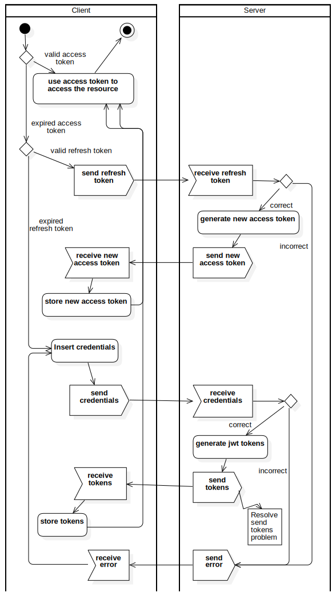

# Diagramma delle attività

## Accesso risorse tramite token JWT

In questo diagramma viene descritto il meccanismo di accesso alle risorse tramite token JWT. Ad ogni richiesta, il client deve includere nel messaggio il token `access`. Questo per ottenere il permesso da parte del server di accedere ad una determinata risorsa. Inizialmente l'utente deve fornire le proprie credenziali che vengono successivamente inviate ed autenticate dal server. Se l'utente è presente nel database e la password è corretta allora vengono ritornati al client 2 token: `access` per autenticare le richieste alle api e `refresh` per rinnovare il token `access`. Allo scadere della validità del token `access`, il client invia una richiesta al server che contene il token `refresh`. Quest'ultimo risponde con il nuovo token `access`. Se anche il token `refresh` è scaduto allora l'utente dovrà riautenticarsi.
