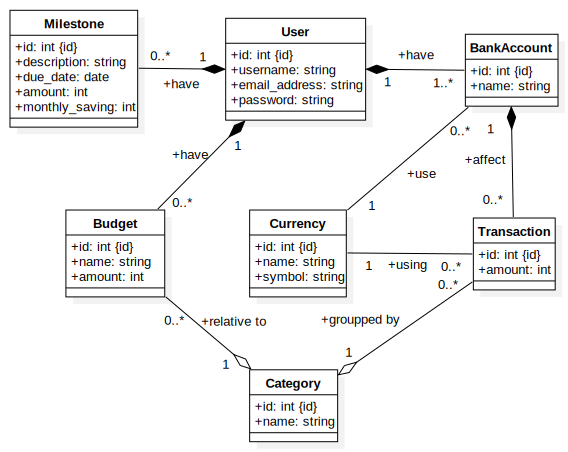

# Diagramma delle classi

In questo diagramma andiamo a specificare in modo più approfondito le entità che interagiscono nel nostro sistema. In particolare abbiamo utilizzato le stesse classi definite nel [diagramma er](er_model.md) specificandone gli attributi. Inoltre abbiamo arricchito il diagramma con cardinalità ed aggregazioni: ad esempio, se viene eliminato `User`, di conseguenza `BankAccount`, `Transaction`, `Milestone` e `Budget` non sono più rilevanti, per questo motivo vengono eliminati; Invece `Budget` e `Transaction` hanno un legame debole con `Category`, ciò significa che se `Category` viene eliminato ciò non porta all'eliminazione di `Budget` e `Transaction`.
