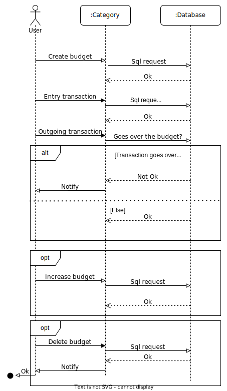

# Diagramma di sequenza

Abbiamo deciso di rappresentare più nel dettaglio il meccanismo di creazione del budget da parte di un utente(`User`) in una determinata categoria, e la relativa possibilità di non rispettarlo, attraverso un diagramma di sequenza. In particolare l'utente, una volta selezionata una categoria (`:Category`), può creare un budget (`Create budget`), e a questo punto tale budget viene creato anche a livello di database del sistema (`Sql request`,`:Database`). Successivamente l'utente può effettuare transizioni in entrata (`Entry transaction`) oppure in uscita (`Outgoing transaction`): in quest'ultimo caso il sistema richiede al database se tale spesa sfora il budget (`Goes over the budget?`) e se così fosse allora viene inviata una notifica all'utente (`Notify`). Questa condizione viene gestita tramite il frame *alt*, il quale gestisce l'invio di messaggi alternativi. Se la notifica di sforamento di budget viene inviata, a quel punto l'utente può decidere se aumentarlo (`Increase budget`) oppure eliminarlo (`Delete budget`). Queste azioni opzionali vengono modellate dal tipo di frame *opt*.
