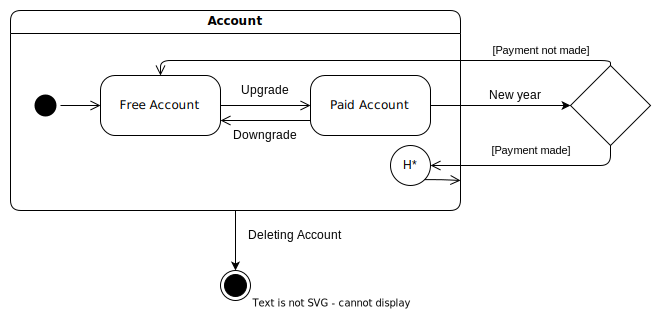

# Diagramma di macchine a stato

Abbiamo deciso di rappresentare più nel dettaglio le azioni di creazione dell'account gratuito e l'eventuale passaggio all'account a pagamento da parte di un utente attraverso un diagramma di macchine a stato. In particolare l'utente una volta creato l'account gratuito (`Free Account`), può decidere di effettuare un upgrade all'account a pagamento (`Paid Account`) sbloccando nuove funzionalità. Da questo punto si ha la possibilità di effettuare un downgrade e tornare all'account gratuito, altrimenti ogni anno occorre effettuare un pagamento per mantenere i privilegi: se ciò avviene allora l'utente può continuare ad utilizzare il servizio (grazie al nodo storia), altrimenti ritorna ad avere un profilo base.
