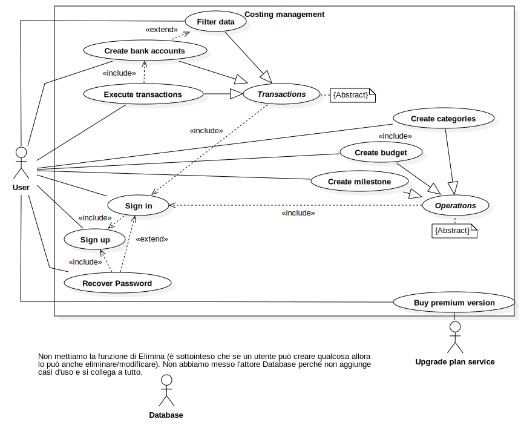

# Diagramma dei casi d'uso

## Diagramma 📄

## Descrizione ✏️

L'attore principale è lo **User**, il quale all'inizio si registra (`Sign Up`), può successivamente accedere al sistema (`Sign In`) e recuperare la password (`Recover Password`). 

Una volta fatto tutto ciò può aggiungere i propri conti (`Create bank accounts`) e solo dopo può segnare i suoi movimenti (`Execute transactions`) e filtrare i dati per avere una visione corretta delle sue spese(`Filter data`).

Anche senza aggiungere i propri conti, l'utente ha la possibilità di creare le categorie dei suoi movimenti (`Create categories`) e di crearsi un obiettivo da raggiungere nel futuro (`Create milestone`). Al contrario, per crearsi un budget (`Create budget`) deve prima aver inserito delle categorie.
Si possono riassumere queste attività con un caso d'uso astratto (`Operations`), che può quindi essere eseguito solo dopo che l'utente ha fatto l'accesso al sistema.

Se l'utente vuole cambiare piano di abbonamento e passare da quello gratuito a quello a pagamento può comprarlo (`Buy premium version`) tramite l'attore **Upgrade plan service**.

## Nota
- Abbiamo deciso di non inserire l'attore **Database** poiché non aggiunge nuovi casi d'uso e si collega a tutto, rendendo il diagramma difficile da leggere.
- Non abbiamo messo il caso d'uso `Elimina` perché già sottointeso che se un utente può aggiungere i propri conti e i suoi movimenti, allora può anche modificarli e/o eliminarli.